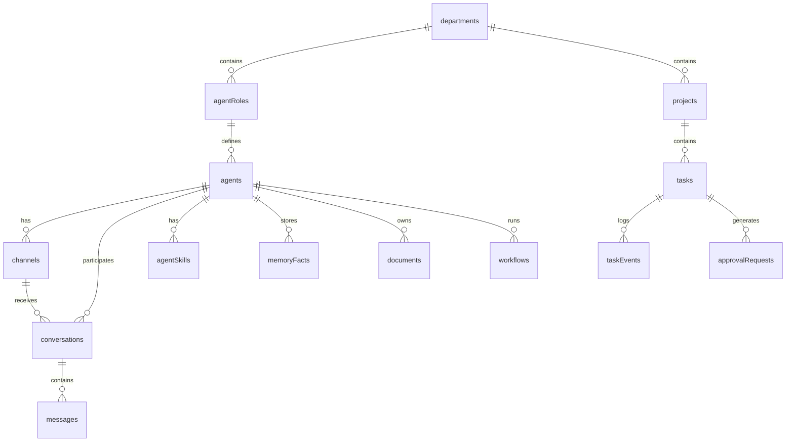

# GabiOS — Architecture Document

> **Last updated:** 2026-04-25 (Sprint 3)

## System Overview

GabiOS is an Edge-native autonomous agent orchestrator built entirely on Cloudflare's network. It manages AI agents as corporate employees within a strict Kanban-driven lifecycle, with budget enforcement, human-in-the-loop governance, and immutable audit trails.

```
┌───────────────────────────────────────────────────────────┐
│                    Cloudflare Edge                        │
│                                                           │
│  ┌──────────┐   ┌──────────┐   ┌──────────┐              │
│  │  Worker   │   │  Cron    │   │  Queue   │              │
│  │ (app.ts)  │   │ Trigger  │   │ Consumer │              │
│  │           │   │ (1 min)  │   │          │              │
│  │ ┌───────┐ │   │          │   │          │              │
│  │ │ React │ │   │ Task     │   │ Agent    │              │
│  │ │ Router│ │   │ Dispatch │   │ Worker   │              │
│  │ └───┬───┘ │   └────┬─────┘   └────┬─────┘              │
│  │ ┌───┴───┐ │        │              │                    │
│  │ │ Hono  │ │        ▼              ▼                    │
│  │ │  API  │ │   ┌─────────┐   ┌──────────┐              │
│  │ └───────┘ │   │ AGENT   │   │ Workers  │              │
│  └──────────┘   │ QUEUE   │   │ AI (LLM) │              │
│                  └─────────┘   └──────────┘              │
│                                                           │
│  ┌────┐  ┌────┐  ┌──────────┐  ┌────────────────┐        │
│  │ D1 │  │ R2 │  │Vectorize │  │ Durable Objects│        │
│  │(DB)│  │    │  │  (RAG)   │  │ (Meeting Rooms)│        │
│  └────┘  └────┘  └──────────┘  └────────────────┘        │
└───────────────────────────────────────────────────────────┘
```

---

## Core Stack

| Layer | Technology | Version |
|-------|-----------|---------|
| **Compute** | Cloudflare Workers (V8 Isolates) | `wrangler ^4.83` |
| **Frontend** | React + React Router v7 (SSR) | `react ^19.1`, `react-router ^7.10` |
| **API** | Hono | `^4.0` |
| **Database** | Cloudflare D1 (SQLite) via Drizzle ORM | `drizzle-orm ^0.45` |
| **AI Inference** | Workers AI + Vercel AI SDK v6 | `ai ^6.0`, `workers-ai-provider ^3.1` |
| **Auth** | Better Auth (sessions + RBAC) | `^1.0` |
| **Storage** | Cloudflare R2 | — |
| **Vector Search** | Cloudflare Vectorize | — |
| **Event Bus** | Cloudflare Queues | — |
| **Collaboration** | Cloudflare Durable Objects | — |
| **Validation** | Zod | `^3.24` |
| **CSS** | Tailwind CSS v4 | `^4.1` |
| **Icons** | Lucide React | `^0.460` |
| **E2E Testing** | Playwright | `^1.59` |

---

## Worker Architecture

The main entry point (`workers/app.ts`) implements three Cloudflare Worker handlers:

### `fetch` — HTTP Requests

```
Request
  ├── /api/* (exceto /api/auth/*) → Hono API server
  └── Everything else           → React Router SSR
```

### `scheduled` — Cron Trigger (every minute)

Invokes the **Task Dispatcher** (`workers/task-dispatcher.ts`):
1. Scans D1 for tasks with `status = 'open'`
2. Validates department token budgets (monthly cap enforcement)
3. Pushes valid tasks onto `AGENT_QUEUE`
4. Marks budget-exceeded tasks as `failed` with audit events

### `queue` — Queue Consumer

Invokes the **Agent Worker** (`workers/agent-worker.ts`):
1. Rehydrates agent context from `task_events` table
2. Constructs system prompt from task + agent SOUL.md
3. Runs the LLM loop via `generateText()` (Workers AI)
4. Logs every step (thoughts, tool calls, results) to `task_events`
5. Records token cost for budget tracking
6. Marks failed tasks as `failed` (fail-secure pattern)

---

## API Layer

All API routes live under `server/routes/` and are mounted via Hono on the `/api` prefix.

### Middleware Pipeline

```
Request → logger() → cors() → [public routes]
                             → authMiddleware → tenantMiddleware → [protected routes]
```

| Middleware | File | Purpose |
|-----------|------|---------|
| **Auth** | `server/middleware/auth.ts` | Validates Better Auth session, injects `user` into context |
| **Tenant** | `server/middleware/tenant.ts` | Resolves tenant D1 binding (V1: single DB, V2: per-tenant) |
| **RBAC** | `server/middleware/rbac.ts` | Role-based access control for admin/restricted routes |

### Route Modules

| Route | File | Auth | Description |
|-------|------|------|-------------|
| `GET /api/health` | `health.ts` | Public | Status, version, timestamp, environment |
| `/api/agents/*` | `agents.ts` | Protected | CRUD for AI agents (create, list, get, update, delete) |
| `/api/chat/*` | `chat.ts` | Protected | Streaming AI chat via Vercel AI SDK |
| `/api/tasks/*` | `tasks.ts` | Protected | Task lifecycle management (Kanban board) |
| `/api/organization/*` | `organization.ts` | Protected | Org settings, departments, roles |
| `/api/standards/*` | `standards.ts` | Protected | SCF compliance framework querying |
| `/api/gap-analysis/*` | `gap-analysis.ts` | Protected | AI-powered compliance gap analysis |

---

## Agent Runtime

The agent system (`server/agent/`) implements a modular runtime for AI agent execution:

```
┌─────────────────────┐
│   context-builder    │  Builds system prompt from SOUL.md + skills + memory
├─────────────────────┤
│       loop           │  Orchestrates the generate → tool → continue cycle
├─────────────────────┤
│   post-processor     │  Extracts memory facts, updates conversation summaries
├─────────────────────┤
│      tools           │  Agent tools (mark_done, request_approval, search, etc.)
├─────────────────────┤
│    chat-tools        │  Chat-specific tools (memory extraction, web search)
├─────────────────────┤
│      types           │  Shared TypeScript types for the agent system
└─────────────────────┘
```

### Files

| File | Purpose |
|------|---------|
| `context-builder.ts` | Assembles the complete prompt: SOUL.md + skills + memory facts + conversation history |
| `loop.ts` | The main agent loop — invokes LLM, processes tool calls, handles step limits |
| `post-processor.ts` | After-response processing — memory extraction, session compaction triggers |
| `tools.ts` | Defines available tools for task-mode agents (mark_done, request_approval) |
| `chat-tools.ts` | Chat-specific tools (store memory facts, search knowledge base) |
| `types.ts` | Shared types: `AgentContext`, `AgentConfig`, `ToolDefinition` |

---

## Database Schema

### Master Registry (`db/master-schema.ts`)

Single central D1 database mapping organizations to tenant databases.

| Table | Purpose |
|-------|---------|
| `tenants` | Maps org → D1 database ID, plan, limits, owner |

### Tenant Schema (`db/schema.ts`)

Each tenant has an isolated database with **15 tables**:



| Table | Key Fields | Purpose |
|-------|-----------|---------|
| `agents` | id, orgId, name, soulMd, modelProvider, modelId, status | AI agent definitions |
| `channels` | id, agentId, type, config, status | Communication channels (webchat/whatsapp/teams) |
| `conversations` | id, agentId, channelId, summary, status | Chat sessions |
| `messages` | id, conversationId, role, content, metadata | Individual messages |
| `agentSkills` | id, agentId, name, instruction, priority | Injected skill instructions |
| `memoryFacts` | id, agentId, category, key, value | Long-term agent memory |
| `documents` | id, orgId, r2Key, mimeType, status, chunkCount | R2 document references for RAG |
| `workflows` | id, orgId, triggerType, steps, enabled | Declarative workflow definitions |
| `auditLogs` | id, orgId, actorId, action, targetType, details | Immutable audit trail |
| `departments` | id, name, budgetLimit, orgId | Organizational departments with token budgets |
| `agentRoles` | id, title, departmentId, reportsToRoleId | Hierarchical agent roles |
| `projects` | id, name, departmentId, status | Work containers |
| `tasks` | id, projectId, assignedAgentId, title, status, costInTokens | Kanban task items |
| `taskEvents` | id, taskId, actorId, actorType, eventType, details | Immutable agent thought/tool ledger |
| `approvalRequests` | id, taskId, status, reason | Human-in-the-loop gates |

---

## Durable Objects

### MeetingRoom (`workers/durable-objects/meeting-room.ts`)

Enables real-time multi-agent collaboration via WebSocket:
- Agents connect, set topics, and exchange reasoning
- Uses Hibernation API for cost-effective idle management
- State persisted via `DurableObjectState.storage`
- Broadcasts messages to all connected participants

---

## Frontend Architecture

### Routing (`app/routes.ts`)

```
/                     → Landing page (home.tsx)
/auth/sign-in         → Authentication
/auth/sign-up         → Registration
/auth/two-factor      → 2FA TOTP verification
/api/auth/*           → Better Auth catch-all
/dashboard            → Dashboard layout (protected)
  /dashboard/agents   → Agent management (CRUD, SOUL.md editor)
  /dashboard/chat     → AI chat interface
  /dashboard/tasks    → Kanban board
  /dashboard/organization → Org management
  /dashboard/security → 2FA settings
/webchat              → WebChat demo widget
```

### Component Library (`app/components/`)

| Directory | Purpose |
|-----------|---------|
| `ui/` | Design system primitives (Button, Input, Card, CardContent) |
| `kanban/` | Task board components |
| `webchat/` | Embeddable chat widget |

### Libraries (`app/lib/`)

| File | Purpose |
|------|---------|
| `auth.server.ts` | Better Auth server configuration (D1-backed sessions) |
| `auth.client.ts` | Client-side auth hooks (signIn, signUp, signOut) |

---

## Security Posture

**OWASP 2025 Audit Score: A (97/100)**

| Control | Implementation |
|---------|---------------|
| **Authentication** | Better Auth sessions, 8-char password minimum |
| **Authorization** | RBAC middleware, org-scoped queries (IDOR prevention) |
| **Input Validation** | Zod schemas on every API endpoint |
| **SQL Injection** | Drizzle ORM parameterized queries exclusively |
| **SSRF Prevention** | `isSafeUrl()` check on all URL ingestion (shared utility) |
| **XSS** | React JSX auto-escaping, zero `dangerouslySetInnerHTML` |
| **CORS** | Origin allowlist (localhost dev + production domain) |
| **CSRF** | Origin validation on mutations |
| **Error Handling** | Generic error responses, no stack trace leakage |
| **Logging** | `logError()` / `logAudit()` across all routes (34/8 calls) |
| **Secrets** | Environment variables via `wrangler secret`, no hardcoded values |

---

## Cloudflare Bindings

Defined in `wrangler.jsonc`:

| Binding | Type | Name | Purpose |
|---------|------|------|---------|
| `DB` | D1 Database | `gabios-db` | Primary relational storage |
| `R2` | R2 Bucket | `gabios-storage` | Document/file storage |
| `VECTORIZE` | Vectorize Index | `gabios-embeddings` | RAG vector search |
| `AI` | Workers AI | — | LLM inference |
| `AGENT_QUEUE` | Queue Producer | `agent-tasks-queue` | Async task dispatch |
| `MEETING_ROOM` | Durable Object | `MeetingRoom` | Multi-agent collaboration |

### Queue Configuration

- **Max batch size:** 10 messages
- **Max batch timeout:** 5 seconds
- **Max retries:** 3
- **Consumer:** `agent-worker.ts`

### Environments

| Environment | `APP_ENV` | Purpose |
|-------------|-----------|---------|
| Default | `development` | Local dev |
| `staging` | `staging` | Pre-production |
| `production` | `production` | Live |

---

## Async Engine — Task Lifecycle

```
 ┌──────┐     ┌────────┐     ┌─────────────┐     ┌──────────────────┐     ┌──────┐
 │ open │ ──► │ queued │ ──► │ in_progress │ ──► │awaiting_approval│ ──► │ done │
 └──────┘     └────────┘     └─────────────┘     └──────────────────┘     └──────┘
    │              │               │                                         │
    │              │               └──── (error) ────────────────────► ┌──────┐
    │              │                                                   │failed│
    └── (budget exceeded) ─────────────────────────────────────────► └──────┘
```

1. **User/API** creates a task → status `open`
2. **Cron Trigger** (every minute) dispatches to queue → status `queued`
3. **Agent Worker** processes → status `in_progress`
4. Agent may request human approval → status `awaiting_approval`
5. Human approves → continues processing
6. Task completes → status `done` (or `failed` on error)

### Budget Enforcement

- Each `department` has a `budgetLimit` (monthly token cap, 0 = unlimited)
- Task Dispatcher checks cumulative token spend before dispatching
- Over-budget tasks are marked `failed` with audit event
- Token costs recorded on each completed agent run

---

## Test Infrastructure

| Type | Tool | Count | Coverage |
|------|------|-------|----------|
| Unit | Vitest | ~489 | Services, utils, validators |
| E2E | Playwright | 10 | Smoke tests (landing, auth, dashboard, API, webchat, 404) |

### E2E Smoke Tests (`e2e/smoke.spec.ts`)

- Landing page hero, features, footer
- Sign-in / Sign-up form rendering and navigation
- Dashboard auth protection
- `GET /api/health` JSON response
- WebChat demo page
- 404 graceful handling
